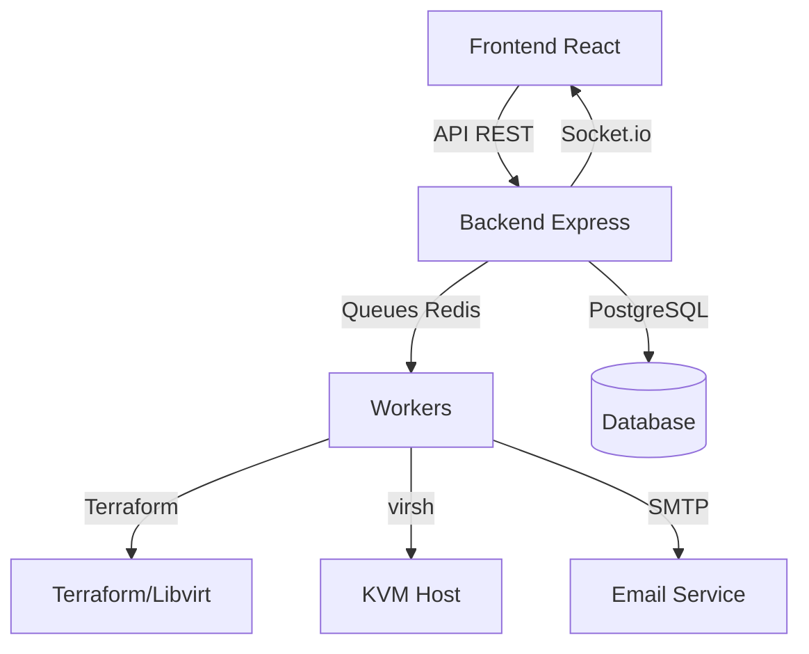

# 📦 OBox - KVM Server Manager

> **MVP** - Gestionnaire de machines virtuelles KVM avec système de queue, monitoring temps réel et administration complète.

---

## 🎯 Concept & Architecture

OBox permet aux utilisateurs de créer, gérer et monitorer des VMs KVM via une interface web moderne. Conçu comme un MVP, il utilise des solutions **simples et robustes**.

### 🏗️ Architecture



**Technologies clés :**
- **Backend** : Node.js, Express , Sequelize, Bull (queues)
- **Frontend** : React, Vite, Tailwind, Socket.io
- **Infrastructure** : Terraform, Libvirt/KVM, Redis
- **Base de données** : PostgreSQL 15

---

## 📁 Structure du Projet

```
.
├── backend/
│   ├── src/
│   │   ├── app.js              # Serveur Express + Socket.io
│   │   ├── config/
│   │   │   ├── db.js           # Connexion PostgreSQL
│   │   │   └── initAdmin.js    # Admin par défaut
│   │   ├── middlewares/
│   │   │   └── auth.js         # JWT + RBAC
│   │   ├── models/
│   │   │   ├── User.js
│   │   │   ├── VirtualMachine.js
│   │   │   └── index.js        # Associations
│   │   ├── routes/
│   │   │   ├── auth.js         # Auth, register, login
│   │   │   ├── vms.js          # CRUD VMs (avec priorités)
│   │   │   ├── admin.js        # Gestion users
│   │   │   └── profile.js      # Profil utilisateur
│   │   │   └── monitoring.js   # Route fallback monitoring
│   │   ├── services/
│   │   │   ├── queue.js        # Queues + priorités
│   │   │   ├── terraform.js    # Terraform wrapper
│   │   │   ├── virsh.js        # Libvirt commands
│   │   │   ├── email.js        # Nodemailer
│   │   │   ├── monitoring.js   # Collecte stats système
│   │   │   └── socket.js       # Socket.io auth & events
│   │   └── workers/
│   │       ├── vm.js           # Worker VMs (create/destroy/action)
│   │       ├── email.js        # Worker emails
│   │       └── monitoring.js   # Worker monitoring (collecte tous les 5s)
│   └── package.json
├── frontend/
│   ├── src/
│   │   ├── App.jsx
│   │   ├── components/
│   │   ├── pages/
│   │   ├── context/
│   │   │   └── AuthContext.jsx
│   │   └── services/
│   │       └── api.js
│   └── vite.config.js
├── terraform/                    # Templates Terraform
│   └── cloud_img/
├── docker-compose.yml            # PostgreSQL + Redis
└── README.md
```

---

## ⚙️ Installation & Démarrage

### Prérequis
```bash
Node.js >= 20
Docker & Docker Compose
KVM/libvirt & Terraform installé sur l'hôte
```

### 1. Cloner & Installer
```bash
git clone <repo> && cd kvm-p
npm install --prefix backend
npm install --prefix frontend
```

### 2. Configuration
```bash
# Backend
cp backend/.env.example backend/.env
# Éditer backend/.env avec vos credentials DB, SMTP, JWT_SECRET

# Terraform
cd terraform/cloud_img
# Placer vos images cloud dans images/ (ex: ubuntu/2404.img, debian/12.qcow2)
```

### 3. Démarrer l'infrastructure
```bash
docker-compose up -d
# PostgreSQL sur localhost:5432
# Redis sur localhost:6379
```

### 4. Lancer l'application
```bash
# Terminal 1 - Backend
cd backend
npm run dev
# API sur http://localhost:4000

# Terminal 2 - Frontend
cd frontend
npm run dev
# App sur http://localhost:5173

# Terminal 3 - Workers (optionnel si START_WORKERS=true)
cd backend
npx nodemon src/workers/vm.js
npx nodemon src/workers/email.js
npx nodemon src/workers/monitoring.js
```

---

## 🔐 Accès par défaut

**Admin** : `admin@gmail.com` / `admin`  
**User** : S'inscrire via `/register` (email vérification requise)

---

## 📊 Concepts Techniques Détaillés

### Queue/Worker System
- **Séparation complète** : Routes uniquement créent des jobs, workers les traitent
- **Persistance** : Redis garde les jobs en cas de crash worker
- **Scalabilité** : Plusieurs workers peuvent consommer la même queue
- **Retry automatique** : 3 tentatives avec backoff de 5s


### Monitoring & Performance
- **Zero overhead** : Pas de service supplémentaire, commandes shell directes
- **Fallback** : Si Socket.io échoue, les stats sont disponibles via API REST (routes `/monitoring`)

---

## 🛡️ Sécurité (MVP)

- **JWT HttpOnly cookies** sur `/api/auth/*`
- **RBAC** : Middleware `requireAdmin` protège toutes les routes admin
- **Validation** : Express-validator sur toutes les entrées
- **CORS** : Restreint à `CORS_ORIGIN`
- **Secure headers** : Helmet.js activé